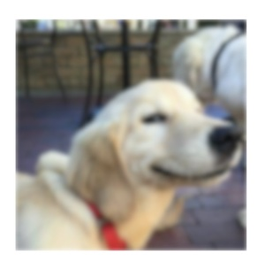

iOSFigmaEffects
========
iOSFigmaEffects seeks to implement the main effects of the Design tool Figma following an interface similar to Figma.

Why Figma?
Figma was chosen because it's free up to two accounts and it's the main collaborative design tool.

iOSFigmaEffects...

 * reduces the communication gap between designers and programmers
 * is ideal for a programmer who wants to learn more about design 
 * is ideal for a programmer who wants to use Figma in their personal projects and have a fast start


Which effects are available?
 -------------------
 
 There are three main effects that are implemented:
 Drop Shadow, Inner Shadow and Layer Blur.
 
 
 

 

 ### 1- Drop Shadow (or Outer Shadow)


 
 


 ### 2- Inner Shadow
 
 
 

 
 ### 3- Layer Blur
 
  
 

 
How do I use it?
-------------------

Each effect is a method of a UIView Extension. 

Just do:
 ```swift 
coolDogImageView.applyDropShadow(color: UIColor.red, y: 4)
coolDogImageView.applyInnerShadow(color: UIColor.red, spread: 4)
coolDogImageView.applyLayerBlur(blur: 5)
```

 ### 1- Drop Shadow (or Outer Shadow) Parameters
 
 ```swift
 func applyDropShadow(
         color: UIColor,
         x: CGFloat,
         y: CGFloat,
         blur: CGFloat,
         spread: CGFloat,
         alpha: Float)
```

* color - shadow color
* x- shadow shift in x
* y-  shadow shift in y 
(If you want a shadow on the bottom, y is positive. Check Figma behavior)
blur - blur value
* spread - shadow size in all directions
* alpha- shadow transparecy
 
 ### 2- Inner Shadow Parameters
 
  ```swift
 func applyInnerShadow(
        color: UIColor = .black,
        x: CGFloat,
        y: CGFloat,
        blur: CGFloat,
        spread: CGFloat,
        alpha: Float)
```

* color - shadow color
* x - shadow shift in x
* y -  shadow shift in y
* blur - blur value
* spread - shadow size in all directions
(If you want a shadow on the bottom, y is negative. Check Figma behavior)
* alpha - shadow transparecy

 
 ### 3- Layer Blur Parameters

  ```swift
func applyLayerBlur(blur blurValue: CGFloat) 
```

* blur - blur value 
(Blur values are approximate to those of Figma)


Add iOSFigmaEffects to your project
----------------------------
(To do)

Requirements
------------
iOS 9+


